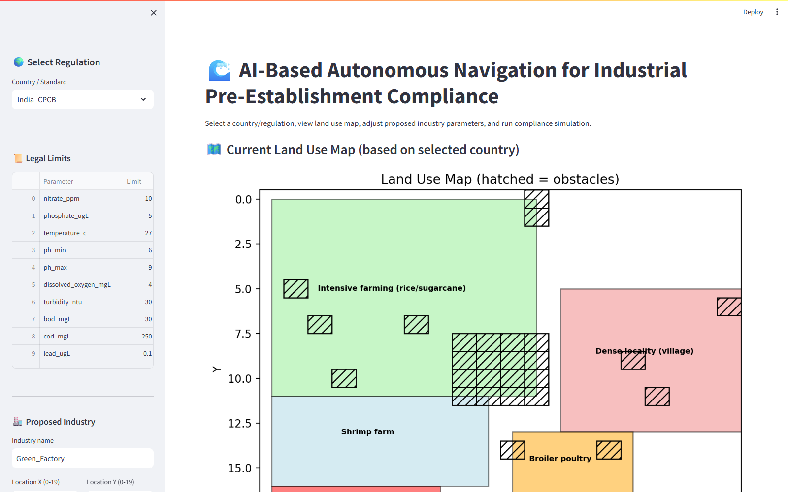

# 🌊 AI‑Based Autonomous Navigation for Industrial Pre‑Establishment Compliance

[](https://python.org)
[](https://streamlit.io)
[](LICENSE)

## 📌 Overview
This project simulates an **autonomous robot boat** that navigates a virtual lake to monitor water quality. It is designed to help **industries (chemical plants, data centers, textile factories, agriculture)** determine if a new facility can be established at a given location without violating environmental laws.

The system uses:
- **A* path planning** for obstacle‑free navigation
- **Multi‑parameter water quality modeling** (nitrate, phosphate, temperature, pH, BOD, COD, turbidity, dissolved oxygen, lead, mercury, chlorophyll‑a)
- **Three regulatory frameworks** (EU Urban Wastewater, India CPCB, US EPA CWA)
- **Realistic land use maps** (farming, villages, fisheries, poultry, data centers, textile factories, chemical plants)

An interactive **Streamlit dashboard** allows users to select a country, adjust proposed discharge parameters, and get an instant **compliance report** with a clear **”build / do not build”** recommendation.

## 🎯 Problem Solved
Manual water sampling is dangerous, expensive, and sparse. Industries risk legal fines and environmental damage from untreated wastewater. This tool provides a **virtual sandbox** to answer: *“If I build here with these discharge parameters, will I pass the law?”*

## 🏭 Industry Value
| Sector | Benefit |
|--------|---------|
| Chemical plants | Verify treatment meets local limits before construction |
| Data centers | Simulate thermal + phosphate impact |
| Textile factories | Check pH, BOD, COD, turbidity |
| Regulators | Evaluate permit applications quickly |

## 🛠️ Tech Stack
- Python 3.12
- Streamlit (interactive dashboard)
- NumPy (grid calculations)
- Matplotlib (visualisations)
- A* path planning

## 📁 Folder Structure
```
.
├── simulation/          # Environment, config, legal limits
├── src/                 # Perception, detection, path planning, navigation
├── dashboard.py         # Main interactive app
├── pre_establishment.py # Command‑line version
├── main.py              # Pygame simulation (optional)
├── requirements.txt
└── README.md
```

## ⚙️ Installation
```bash
git clone https://github.com/TannikaGhosh/-AI-Autonomous-Navigation-Industrial.git
cd -AI-Autonomous-Navigation-Industrial
python -m venv venv
source venv/bin/activate   # or venv\Scripts\activate on Windows
pip install -r requirements.txt
```

## ▶️ Run the Dashboard
```bash
streamlit run dashboard.py
```

## 🖥️ How to Use
1. Select a country (EU, India, US, or Custom).
2. View the land use map (colored blocks represent existing pollution sources).
3. Enter your proposed industry’s location and discharge parameters.
4. Check **“Evaluate only proposed location”** to ignore background pollution.
5. Click **”Run Compliance Simulation”**.
6. See the heatmap, robot path, compliance table, and final recommendation.

## 📸 Sample Output (US EPA CWA)


Example inputs that give a **”CAN be established”** recommendation:
- Country: `US_EPA_CWA`
- Location: `(18,18)`
- Nitrate: `0.10 ppm`
- Phosphate: `0.10 µg/L`
- Temperature rise: `1.0°C`
- BOD: `5.0 mg/L`
- COD: `20.0 mg/L`
- Lead: `0.01 µg/L`
- Mercury: `0.001 µg/L`

## 📊 Compliance Report Example
| Parameter | Worst measured | Limit | Status |
|-----------|----------------|-------|--------|
| nitrate_ppm | 0.10 | 10 | ✅ Pass |
| phosphate_ugL | 0.10 | 8 | ✅ Pass |
| ... | ... | ... | ✅ Pass |

**Final recommendation:** ✅ **CAN be established**

## 🔮 Future Improvements
- Real‑time camera + YOLO for visual algae detection
- ROS integration for real robot deployment
- Cloud dashboard with SMS alerts

## 📚 Learning Outcomes
- Implemented A* path planning in Python
- Simulated pollution dispersion using exponential decay
- Built an interactive compliance dashboard with Streamlit
- Integrated multi‑country environmental regulations

## 👨💻 Author
Tannika Ghosh – [LinkedIn](https://www.linkedin.com/in/tannika-ghosh-0b1497338) – [GitHub](https://github.com/TannikaGhosh)

---

*This project is a proof of work for autonomous systems, environmental monitoring, and industrial compliance.*
